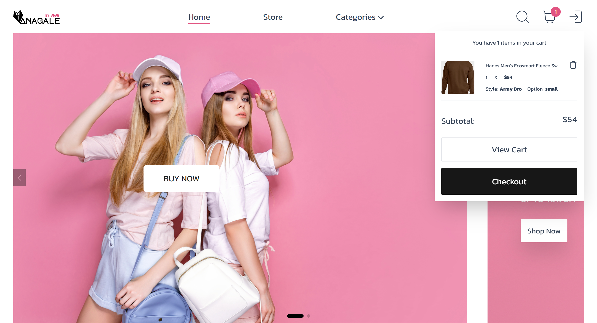
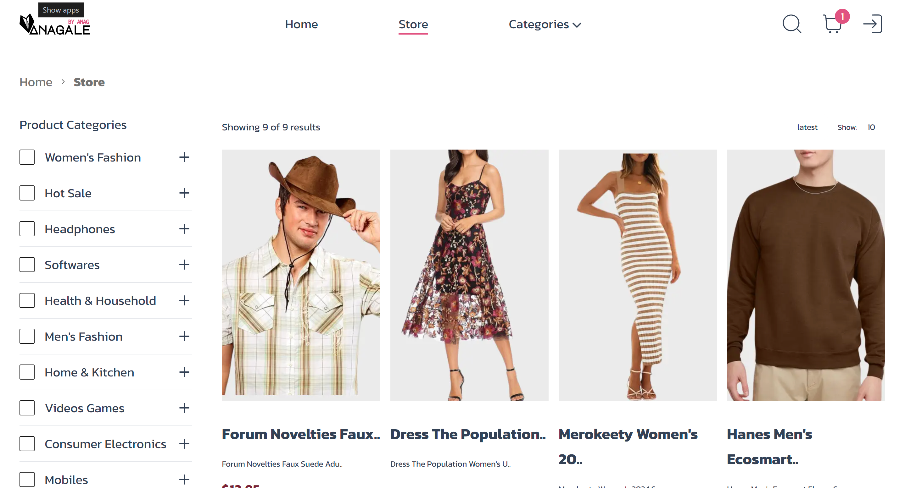
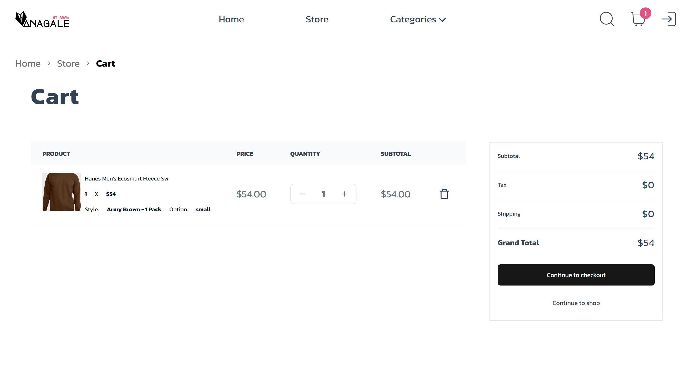
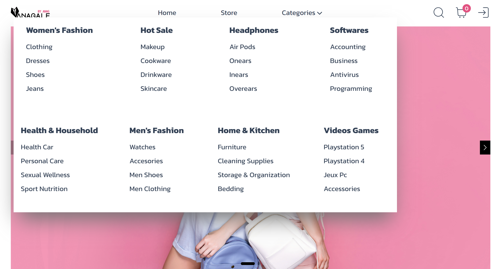
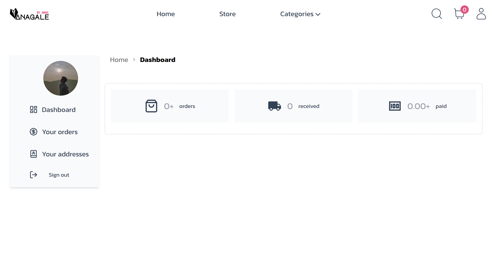

# Anagale - Full Project Documentation

[Check Project Demo App!](https://anagale-ecommerce.vercel.app/))
[Know more about the Developer!](https://bento.me/anag)

## ✔️ Introduction

Welcome to **Anagale** – a project focused on developing frontend solutions using **React** and **Next.js**. This project aims to simplify complex frontend tasks by providing a step-by-step framework for creating responsive designs from scratch, using tools like TailwindCSS and Figma.


## Become a Frontend Next.js Developer - Full Project Guide

### Project Preview

<table>
  <tr>
    <td><a href='Home'></a></td>
    <td><a href='List'></a></td>
    <td><a href='Cart'></a></td>
     <td><a href='Categories'></a></td>
      <td><a href='Account Management'></a></td>
  </tr>
</table>

## 🎯 Key Skills Learned

This project enhances skills in the following areas:

- Proficiency in **JavaScript (ES6+), React.js**, and **Next.js**.
- Hands-on experience with **React Components**, **State Management**, and **Hooks**.
- Knowledge of **server-side rendering (SSR)**, **static site generation (SSG)**, and **client-side rendering**.
- RESTful API handling.
- Mastery of **CSS Frameworks** (TailwindCSS) and responsive web design.
- Familiarity with **version control** (Git).
- Exposure to testing frameworks such as **Jest, React Testing Library**, and **Cypress**.
- Optimization and accessibility-focused web design.

## ✅ Prerequisites

This project assumes basic knowledge of HTML, CSS, JavaScript, but no prior experience with React or Next.js.

## ✅ System Requirements

Ensure the following are installed:

- **Node.js** (20.12.0 or later)
- Supported OS: macOS, Windows (WSL), or Linux.
- **VSCode** or any text editor of your choice.


## 📅 Code Organization and Folder Structure

This project follows a structured Next.js App Router layout for seamless routing and efficient file management.

```plaintext

├───actions
├───app                 
│   └───(website)
│       ├───(auth)
│       │   ├───sign-in
│       │   │   └───[[...sign-in]]
│       │   └───sign-up
│       │       └───[[...sign-up]]
│       └───(pages)
│           ├───(home)
│           ├───account
│           │   ├───address
│           │   ├───dashboard
│           │   └───orders
│           ├───cart
│           ├───categories
│           │   └───[slug]
│           │       └───products
│           ├───checkout
│           ├───order
│           │   └───[id]
│           └───products
│               └───[slug]
├───components
│   ├───custom
│   ├───modules
│   │   └───website
│   │       ├───account
│   │       ├───cart
│   │       ├───categories
│   │       ├───checkout
│   │       ├───footer
│   │       ├───header
│   │       ├───home
│   │       ├───order
│   │       ├───product
│   │       ├───products
│   │       └───review
│   └───ui
├───constants
├───cypress
│   ├───e2e
│   ├───fixtures
│   ├───pages
│   ├───selectors
│   └───support
├───data
├───hooks
├───lib
├───providers
├───public
│   └───assets
│       └───images
├───store
├───types
└───_tests_
    └───ui
    
```
## Quickstart Guide

### Clone the Project

```bash
git clone https://github.com/Anag0710/anagale
```
### Install Dependencies
```bash
npm install
```
### Run the Project Locally
```bash
npm start
```
### Environment Setup
- Create an .env file in the project root and add:
```bash
NEXT_PUBLIC_SERVER_URL=http://localhost:3000
NEXT_PUBLIC_API_URL=https://fractal-api-zeta.vercel.app
# Clerk integration 
NEXT_PUBLIC_CLERK_PUBLISHABLE_KEY=
CLERK_SECRET_KEY=
# Stripe integration 
NEXT_PUBLIC_STRIPE_CLIENT_KEY=
STRIPE_SECRET_KEY=
```
